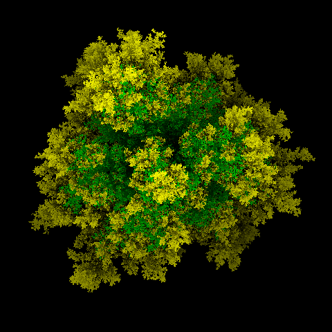
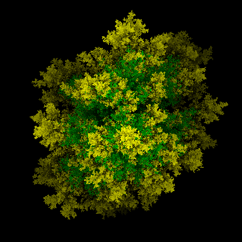

# Simple diffusion limited aggregation

Very simple DLA Golang implementation

Further reading:

- https://github.com/fogleman/dlaf — very similar C++ implementation
- http://paulbourke.net/ — really interesting site (not only about DLA)
