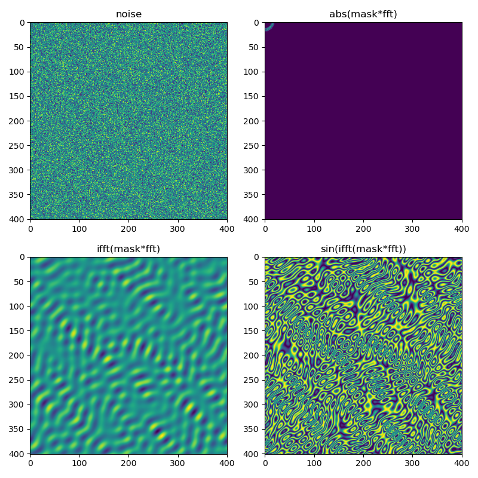

# Build wave-like textures using FFT

Roughly speaking, I use FFT-shape-iFFT procedure to generate periodic nature-like textures. You can shape FFT to get

  - `|---|`-shaped (no shape) — noise
  - `|_-_|`-shaped (peak shape) — waves (on the image)
  - `|-__|`-shaped (eliminate higher harmonics) — mountains
