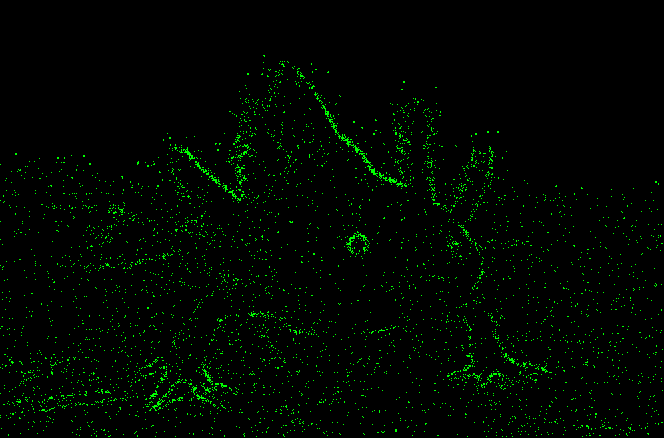

# graphic-effects

```
go run . example.jpg
```

## Source


## Edge Detection step

Sobel-like edge detection


## Pivot points



## First try

- :heavy_check_mark: non euclidean distances are cool
- :negative_squared_cross_mark: naive algorithm too slow
- :negative_squared_cross_mark: it seems Voronoi not so cool; try Delaunay? try weights of points?
- :negative_squared_cross_mark: it seems just random pivots is oversimplification; it has to be used some optimization?


## Related links

- [Voronoi Diagrams and Procedural Map Generation](https://youtu.be/3G5d8ob_Lfo)
- [Delaunay triangulation](https://www.esimov.com/2019/04/image-triangulation-in-go#.YpxKwXVBxhE), [code](https://github.com/esimov/triangle)
- [Primitive Pictures](https://github.com/fogleman/primitive) (very cool!)
