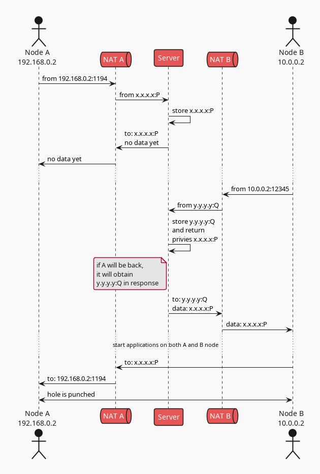
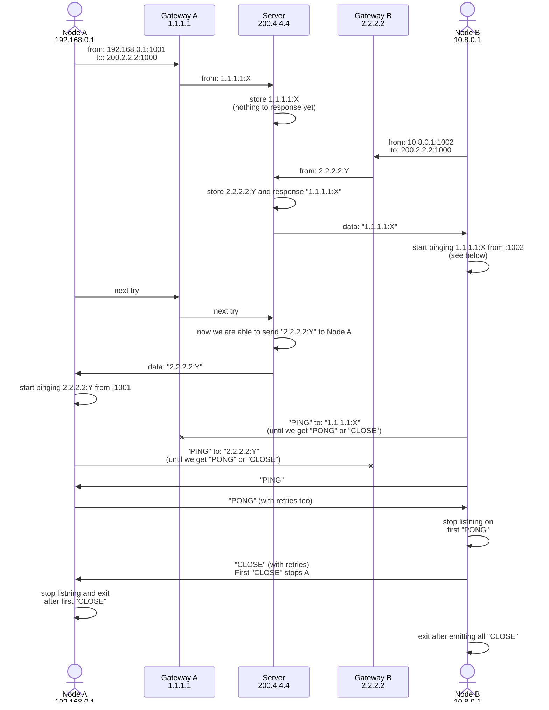

# Network hole punching tool

Try mermaid

## Related links

- [Peer-to-Peer Communication Across Network Address Translators](https://bford.info/pub/net/p2pnat/): fundamental work on P2P drilling
- [Setup OpenVPN](https://ubuntu.com/server/docs/service-openvpn)
