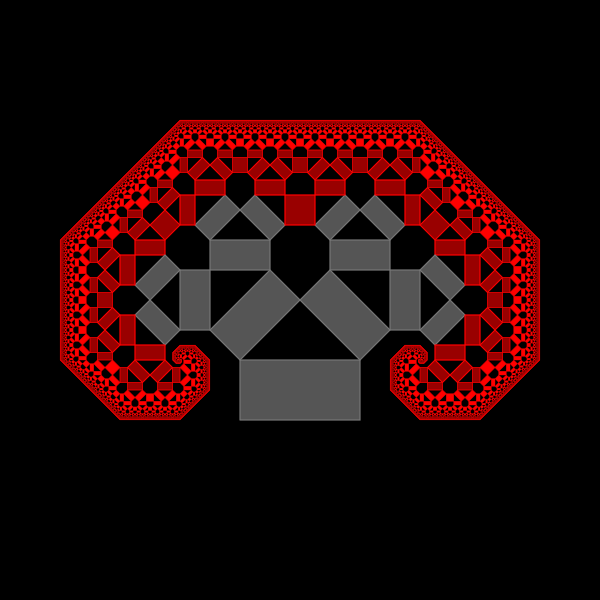
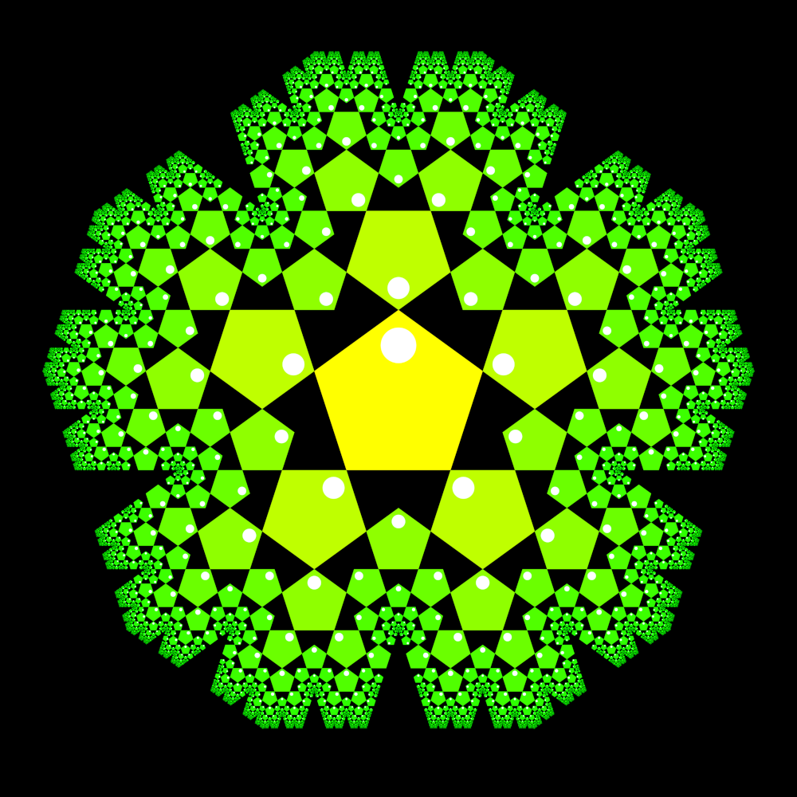

# IFS: iterated function systems

Playing with fractals using complex numbers. You can use it to generate
images like this:

([Discussion on reddit](https://www.reddit.com/r/GeometryIsNeat/comments/sfo6vh/meta_fibonacci_quasi_fractal_pentagons_frankly_i/))
