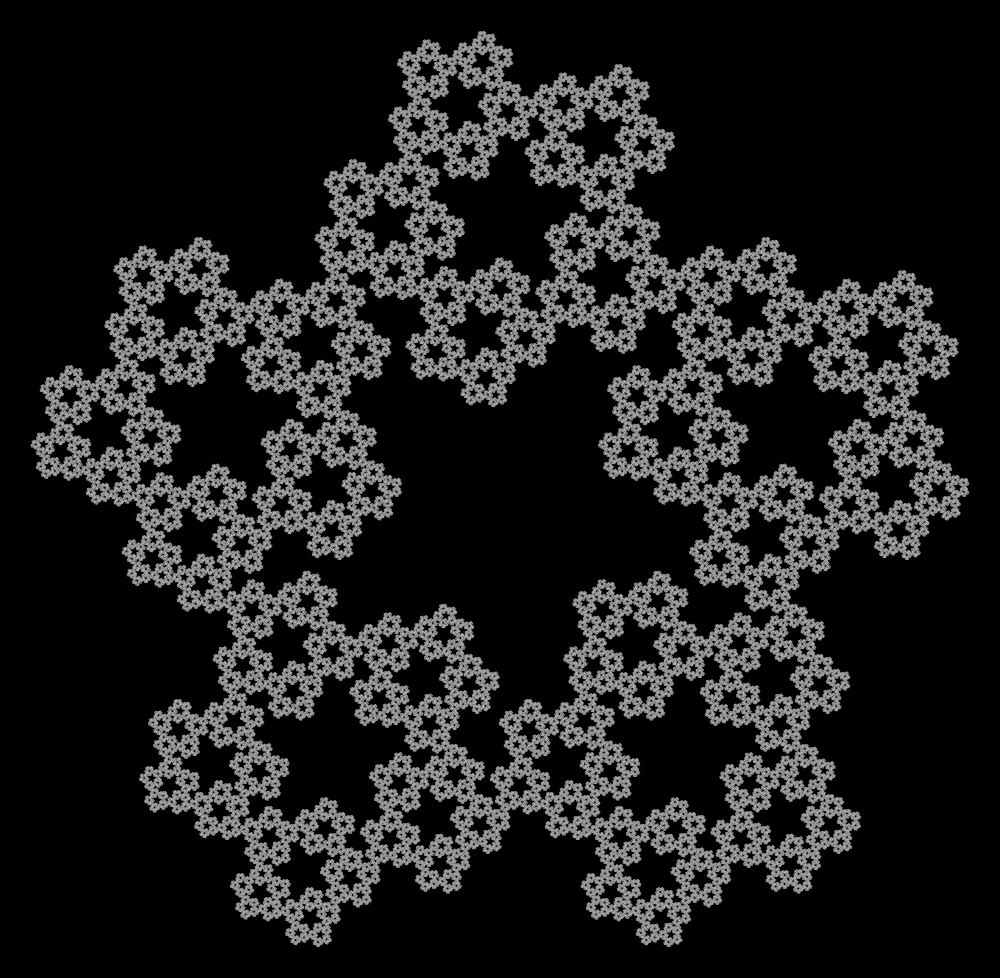

# IFS: iterated function systems

Playing with fractals using complex numbers. You can use it to generate
images like this:

([Discussion on reddit](https://www.reddit.com/r/GeometryIsNeat/comments/sfo6vh/meta_fibonacci_quasi_fractal_pentagons_frankly_i/),
[and one more animated](https://www.reddit.com/r/generative/comments/sg565y/fibonacci_pentagons/))

One more [pentaflake](https://en.wikipedia.org/wiki/N-flake). With rotation.

([Discussion on reddit](https://www.reddit.com/r/fractals/comments/1p4f5ds/pentaflake_with_rotation/))
